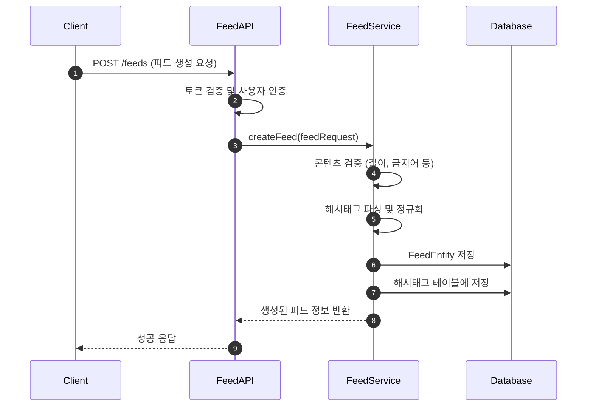
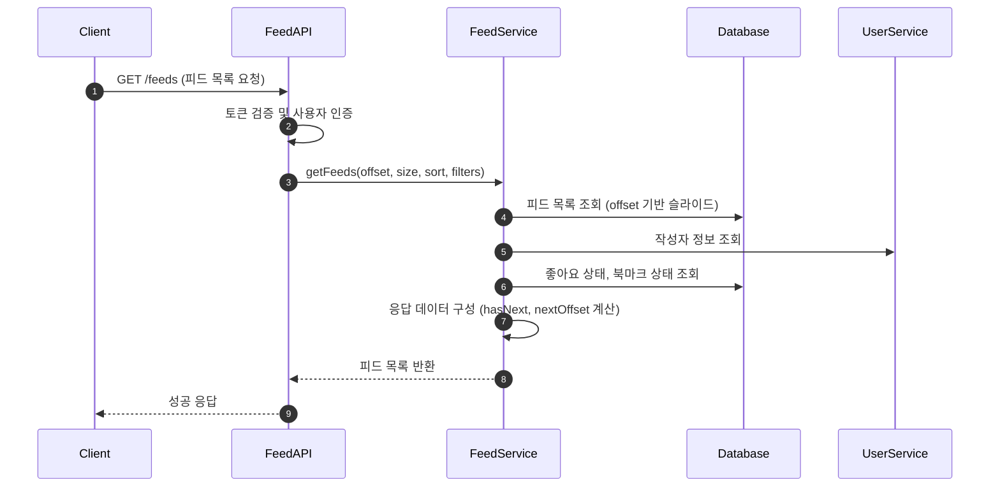
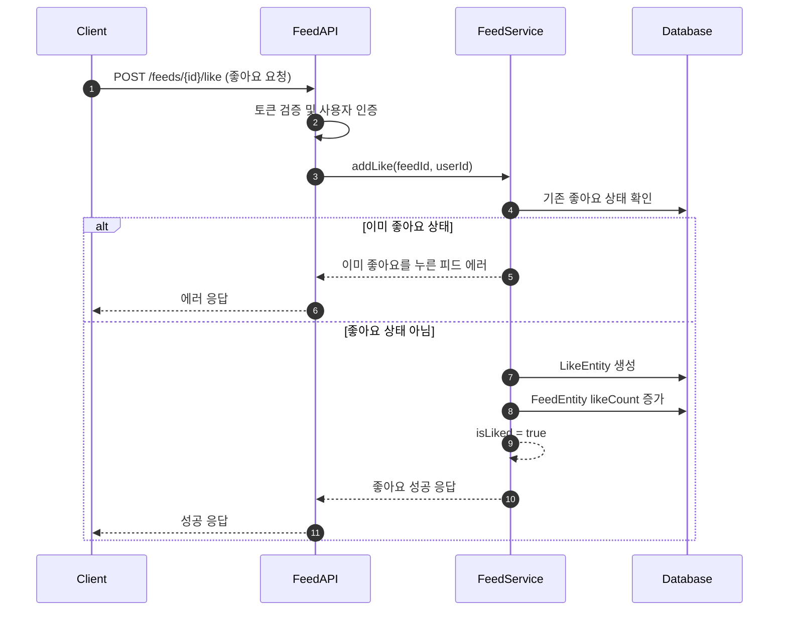
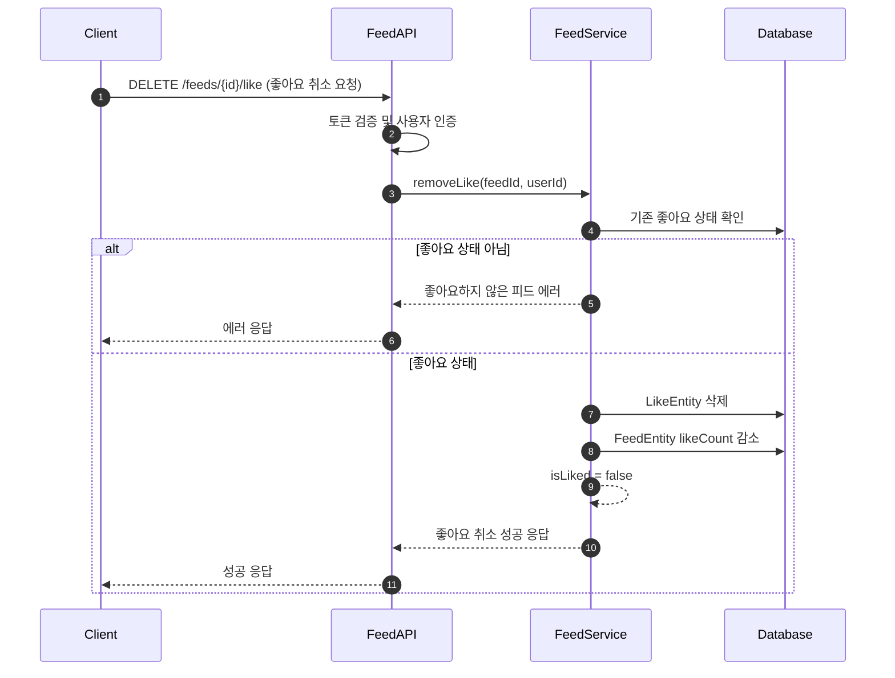
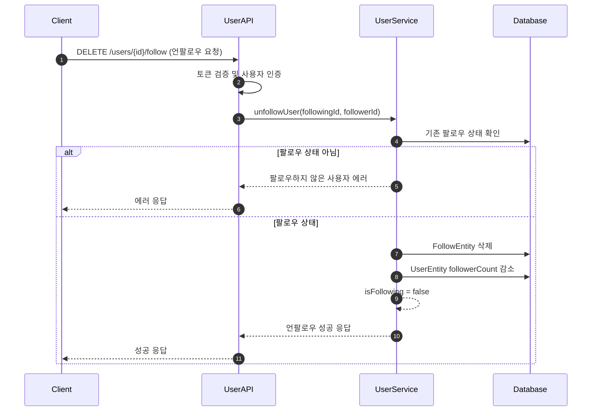

# 피드 서비스 명세서

## 개요

소셜 미디어 스타일의 피드 기능에 대한 기술 명세서

## 목차

1. [서비스 개요](#서비스-개요)
2. [기능 요구사항](#기능-요구사항)
3. [비기능 요구사항](#비기능-요구사항)
4. [API 명세](#api-명세)
5. [데이터 모델](#데이터-모델)
6. [에러 처리](#에러-처리)
7. [구현 계획](#구현-계획)
8. [로직 플로우](#로직-플로우)

## 서비스 개요

사용자들이 콘텐츠를 공유하고, 다른 사용자의 콘텐츠를 피드 형태로 조회할 수 있는 소셜 피드 서비스

## 기능 요구사항

### 핵심 기능
- 피드 포스트 생성/수정/삭제
- 피드 포스트 조회 (전체/사용자별/카테고리별)
- 좋아요/좋아요 취소
- 댓글 작성/수정/삭제
- 댓글 좋아요/좋아요 취소
- 피드 포스트 공유
- 해시태그 기능
- 사용자 팔로우/언팔로우
- 피드 정렬 (최신순, 인기순, 팔로우순)

### 부가 기능
- 피드 포스트 신고
- 콘텐츠 필터링 (성인 콘텐츠, 폭력성 등)
- 피드 포스트 북마크
- 알림 기능 (좋아요, 댓글, 팔로우)
- 검색 기능 (해시태그, 사용자, 콘텐츠)

## API 명세

### 피드 관련 API

#### 피드 포스트 생성
```http
POST /api/v1/feeds
Authorization: Bearer {token}
Content-Type: application/json

Request:
{
  "content": "피드 포스트 내용입니다.",
  "mediaUrls": ["https://example.com/image1.jpg", "https://example.com/image2.jpg"],
  "hashtags": ["#코딩", "#개발"],
  "isPublic": true,
  "category": "TECH"
}

Response:
{
  "success": true,
  "data": {
    "id": 123456789,
    "content": "피드 포스트 내용입니다.",
    "mediaUrls": ["https://example.com/image1.jpg", "https://example.com/image2.jpg"],
    "hashtags": ["#코딩", "#개발"],
    "isPublic": true,
    "category": "TECH",
    "authorId": 987654321,
    "authorName": "개발자",
    "authorProfileImage": "https://example.com/profile.jpg",
    "likeCount": 0,
    "commentCount": 0,
    "shareCount": 0,
    "createdAt": "2024-01-15T10:30:00Z",
    "updatedAt": "2024-01-15T10:30:00Z"
  }
}
```

#### 피드 목록 조회
```http
GET /api/v1/feeds?offset=0&size=20&sort=latest&category=TECH&hashtag=코딩
Authorization: Bearer {token}

Response:
{
  "success": true,
  "data": {
    "content": [
      {
        "id": 123456789,
        "content": "피드 포스트 내용입니다.",
        "mediaUrls": ["https://example.com/image1.jpg"],
        "hashtags": ["#코딩", "#개발"],
        "isPublic": true,
        "category": "TECH",
        "authorId": 987654321,
        "authorName": "개발자",
        "authorProfileImage": "https://example.com/profile.jpg",
        "likeCount": 15,
        "commentCount": 3,
        "shareCount": 2,
        "isLiked": true,
        "isBookmarked": false,
        "createdAt": "2024-01-15T10:30:00Z"
      }
    ],
    "slideable": {
      "offset": 0,
      "size": 20,
      "totalElements": 150,
      "hasNext": true,
      "nextOffset": 20
    }
  }
}
```

#### 피드 포스트 상세 조회
```http
GET /api/v1/feeds/{feedId}
Authorization: Bearer {token}

Response:
{
  "success": true,
  "data": {
    "id": 123456789,
    "content": "피드 포스트 내용입니다.",
    "mediaUrls": ["https://example.com/image1.jpg"],
    "hashtags": ["#코딩", "#개발"],
    "isPublic": true,
    "category": "TECH",
    "authorId": 987654321,
    "authorName": "개발자",
    "authorProfileImage": "https://example.com/profile.jpg",
    "likeCount": 15,
    "commentCount": 3,
    "shareCount": 2,
    "isLiked": true,
    "isBookmarked": false,
    "createdAt": "2024-01-15T10:30:00Z",
    "updatedAt": "2024-01-15T10:30:00Z",
    "comments": [
      {
        "id": 456789123,
        "content": "좋은 글이네요!",
        "authorId": 111222333,
        "authorName": "댓글러",
        "authorProfileImage": "https://example.com/profile2.jpg",
        "likeCount": 2,
        "isLiked": false,
        "createdAt": "2024-01-15T11:00:00Z"
      }
    ]
  }
}
```

#### 좋아요 추가
```http
POST /api/v1/feeds/{feedId}/like
Authorization: Bearer {token}

Response:
{
  "success": true,
  "data": {
    "isLiked": true,
    "likeCount": 16
  }
}
```

#### 좋아요 취소
```http
DELETE /api/v1/feeds/{feedId}/like
Authorization: Bearer {token}

Response:
{
  "success": true,
  "data": {
    "isLiked": false,
    "likeCount": 15
  }
}
```

#### 댓글 작성
```http
POST /api/v1/feeds/{feedId}/comments
Authorization: Bearer {token}
Content-Type: application/json

Request:
{
  "content": "좋은 글이네요!",
  "parentCommentId": null
}

Response:
{
  "success": true,
  "data": {
    "id": 456789123,
    "content": "좋은 글이네요!",
    "authorId": 111222333,
    "authorName": "댓글러",
    "authorProfileImage": "https://example.com/profile2.jpg",
    "likeCount": 0,
    "isLiked": false,
    "createdAt": "2024-01-15T11:00:00Z"
  }
}
```

#### 댓글 좋아요 추가
```http
POST /api/v1/comments/{commentId}/like
Authorization: Bearer {token}

Response:
{
  "success": true,
  "data": {
    "isLiked": true,
    "likeCount": 3
  }
}
```

#### 댓글 좋아요 취소
```http
DELETE /api/v1/comments/{commentId}/like
Authorization: Bearer {token}

Response:
{
  "success": true,
  "data": {
    "isLiked": false,
    "likeCount": 2
  }
}
```

### 사용자 관련 API

#### 사용자 팔로우
```http
POST /api/v1/users/{userId}/follow
Authorization: Bearer {token}

Response:
{
  "success": true,
  "data": {
    "isFollowing": true,
    "followerCount": 156
  }
}
```

#### 사용자 언팔로우
```http
DELETE /api/v1/users/{userId}/follow
Authorization: Bearer {token}

Response:
{
  "success": true,
  "data": {
    "isFollowing": false,
    "followerCount": 155
  }
}
```

## 데이터 모델

### FeedEntity
```kotlin
@Entity
@Table(name = "feeds")
data class FeedEntity(
    @Column(nullable = false, columnDefinition = "TEXT")
    val content: String,
    
    @ElementCollection
    @CollectionTable(name = "feed_media_urls", joinColumns = [JoinColumn(name = "feed_id")])
    @Column(name = "media_url")
    val mediaUrls: List<String> = emptyList(),
    
    @ElementCollection
    @CollectionTable(name = "feed_hashtags", joinColumns = [JoinColumn(name = "feed_id")])
    @Column(name = "hashtag")
    val hashtags: List<String> = emptyList(),
    
    @Column(nullable = false)
    val isPublic: Boolean = true,
    
    @Enumerated(EnumType.STRING)
    @Column(nullable = false)
    val category: FeedCategory,
    
    @Column(nullable = false)
    val authorId: Long,
    
    @Column(nullable = false)
    val likeCount: Int = 0,
    
    @Column(nullable = false)
    val commentCount: Int = 0,
    
    @Column(nullable = false)
    val shareCount: Int = 0,
    
    @Column(nullable = false)
    val viewCount: Int = 0,
    
    @Enumerated(EnumType.STRING)
    @Column(nullable = false)
    val status: FeedStatus = FeedStatus.ACTIVE
) : BaseEntity()
```

### CommentEntity
```kotlin
@Entity
@Table(name = "comments")
data class CommentEntity(
    @Column(nullable = false, columnDefinition = "TEXT")
    val content: String,
    
    @Column(nullable = false)
    val feedId: Long,
    
    @Column(nullable = false)
    val authorId: Long,
    
    @Column
    val parentCommentId: Long? = null,
    
    @Column(nullable = false)
    val likeCount: Int = 0,
    
    @Enumerated(EnumType.STRING)
    @Column(nullable = false)
    val status: CommentStatus = CommentStatus.ACTIVE
) : BaseEntity()
```

### LikeEntity
```kotlin
@Entity
@Table(name = "likes")
data class LikeEntity(
    @Column(nullable = false)
    val userId: Long,
    
    @Column(nullable = false)
    val targetId: Long,
    
    @Enumerated(EnumType.STRING)
    @Column(nullable = false)
    val targetType: LikeTargetType,
    
    @Column(nullable = false)
    val createdAt: LocalDateTime = LocalDateTime.now()
) : BaseEntity()
```

### FollowEntity
```kotlin
@Entity
@Table(name = "follows")
data class FollowEntity(
    @Column(nullable = false)
    val followerId: Long,
    
    @Column(nullable = false)
    val followingId: Long,
    
    @Column(nullable = false)
    val createdAt: LocalDateTime = LocalDateTime.now()
) : BaseEntity()
```

### BookmarkEntity
```kotlin
@Entity
@Table(name = "bookmarks")
data class BookmarkEntity(
    @Column(nullable = false)
    val userId: Long,
    
    @Column(nullable = false)
    val feedId: Long,
    
    @Column(nullable = false)
    val createdAt: LocalDateTime = LocalDateTime.now()
) : BaseEntity()
```

### Enum 클래스들
```kotlin
enum class FeedCategory {
    TECH,       // 기술
    LIFESTYLE,  // 라이프스타일
    TRAVEL,     // 여행
    FOOD,       // 음식
    SPORTS,     // 스포츠
    ENTERTAINMENT, // 엔터테인먼트
    NEWS,       // 뉴스
    OTHER       // 기타
}

enum class FeedStatus {
    ACTIVE,     // 활성
    HIDDEN,     // 숨김
    DELETED,    // 삭제됨
    REPORTED    // 신고됨
}

enum class CommentStatus {
    ACTIVE,     // 활성
    HIDDEN,     // 숨김
    DELETED     // 삭제됨
}

enum class LikeTargetType {
    FEED,       // 피드
    COMMENT     // 댓글
}
```

## 에러 처리

### 에러 코드 정의

| 에러 코드                   | HTTP 상태 | 메시지                     | 설명              |
|-------------------------| ------- | ----------------------- | --------------- |
| FEED_NOT_FOUND          | 404     | 피드를 찾을 수 없습니다           | 존재하지 않는 피드 ID   |
| FEED_ACCESS_DENIED      | 403     | 피드에 접근할 권한이 없습니다        | 비공개 피드 접근 시도   |
| FEED_CONTENT_EMPTY      | 400     | 피드 내용을 입력해주세요           | 빈 내용으로 피드 생성 시도 |
| FEED_TOO_LONG           | 400     | 피드 내용이 너무 깁니다            | 최대 길이 초과        |
| COMMENT_NOT_FOUND       | 404     | 댓글을 찾을 수 없습니다           | 존재하지 않는 댓글 ID   |
| COMMENT_ACCESS_DENIED   | 403     | 댓글에 접근할 권한이 없습니다        | 권한 부족           |
| COMMENT_CONTENT_EMPTY   | 400     | 댓글 내용을 입력해주세요           | 빈 내용으로 댓글 작성 시도 |
| USER_NOT_FOUND          | 404     | 사용자를 찾을 수 없습니다           | 존재하지 않는 사용자 ID |
| ALREADY_LIKED           | 400     | 이미 좋아요를 눌렀습니다            | 중복 좋아요 시도      |
| NOT_LIKED               | 400     | 좋아요하지 않은 피드입니다           | 좋아요 취소 시도 시      |
| ALREADY_FOLLOWING       | 400     | 이미 팔로우 중입니다              | 중복 팔로우 시도      |
| NOT_FOLLOWING           | 400     | 팔로우하지 않은 사용자입니다          | 언팔로우 시도 시      |
| CANNOT_FOLLOW_SELF      | 400     | 자신을 팔로우할 수 없습니다          | 자기 자신 팔로우 시도   |
| INVALID_HASHTAG         | 400     | 올바르지 않은 해시태그 형식입니다       | 잘못된 해시태그 형식    |
| RATE_LIMIT_EXCEEDED     | 429     | 요청이 너무 많습니다. 잠시 후 다시 시도해주세요 | Rate Limiting 초과 |

### 에러 응답 형식
```json
{
  "success": false,
  "error": {
    "code": "FEED_NOT_FOUND",
    "message": "피드를 찾을 수 없습니다",
    "details": "요청한 피드 ID: 123456789"
  }
}
```

## 구현 계획

### Phase 1: 기본 기능
- [ ] 피드 포스트 CRUD API
- [ ] 댓글 CRUD API
- [ ] 좋아요 기능
- [ ] 기본 데이터 모델 및 엔티티
- [ ] 단순 피드 조회 (최신순)

### Phase 2: 소셜 기능
- [ ] 사용자 팔로우/언팔로우
- [ ] 팔로우 피드 조회
- [ ] 해시태그 기능
- [ ] 피드 공유 기능
- [ ] 북마크 기능

### Phase 3: 고도화
- [ ] 피드 정렬 옵션 (인기순, 팔로우순)
- [ ] 검색 기능
- [ ] 카테고리별 필터링
- [ ] 알림 시스템
- [ ] 신고 기능

### Phase 4: 최적화
- [ ] 캐싱 전략
- [ ] offset 기반 슬라이드 조회 최적화
- [ ] 성능 모니터링
- [ ] 부하 테스트

## 로직 플로우

### 피드 생성 플로우


### 피드 조회 플로우


### 좋아요 추가 플로우


### 좋아요 취소 플로우


### 팔로우 처리 플로우

```mermaid
sequenceDiagram
  autonumber
  participant C as Client
  participant API as UserAPI
  participant S as UserService
  participant DB as Database

  C->>API: POST /users/{id}/follow (팔로우 요청)
  API->>API: 토큰 검증 및 사용자 인증
  API->>S: followUser(followingId, followerId)
  S->>S: 자기 자신 팔로우 방지 검증
  S->>DB: 기존 팔로우 상태 확인
  alt 이미 팔로우 상태
    S-->>API: 이미 팔로우 중인 사용자 에러
    API-->>C: 에러 응답
  else 팔로우 상태 아님
    S->>DB: FollowEntity 생성
    S->>DB: UserEntity followerCount 증가
    S-->>S: isFollowing = true
    S-->>API: 팔로우 성공 응답
    API-->>C: 성공 응답
  end
```


### 언팔로우 처리 플로우

