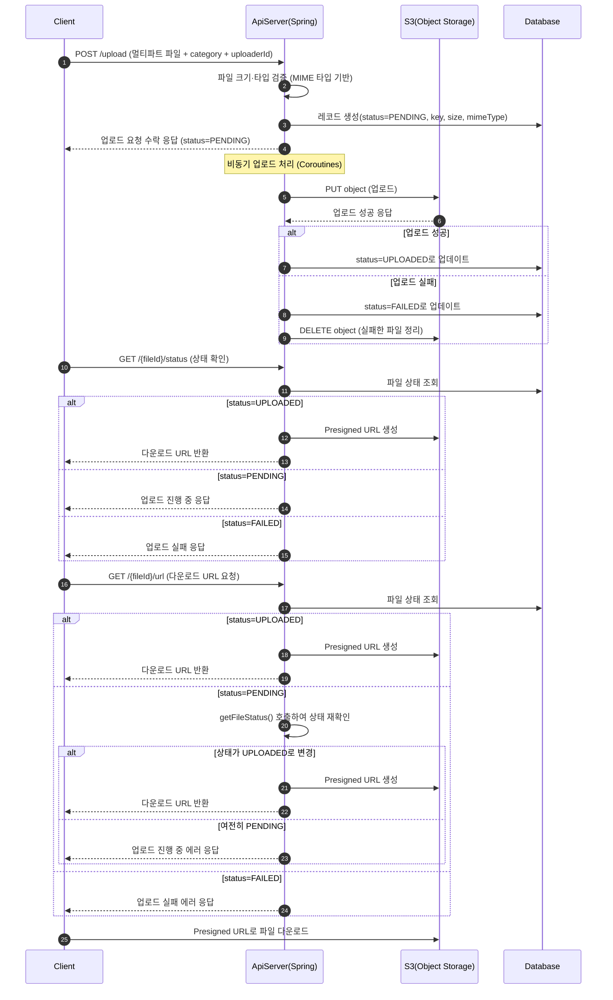

# 파일 업로드 서비스 명세서

## 개요

파일 업로드 서비스에 대한 기술 명세서

## 목차

1. [서비스 개요](#서비스-개요)
2. [기능 요구사항](#기능-요구사항)
3. [비기능 요구사항](#비기능-요구사항)
4. [API 명세](#api-명세)
5. [데이터 모델](#데이터-모델)
6. [에러 처리](#에러-처리)
7. [보안 요구사항](#보안-요구사항)
8. [구현 계획](#구현-계획)

## 서비스 개요

파일 업로드/다운로드 서비스로 S3 스토리지와 연동하여 파일 타입 검증 및 Presigned URL을 통한 접근을 제공합니다.

## 기능 요구사항

- 멀티파트 파일 업로드
- 파일 크기, 타입 검증 (MIME 타입 기반)
- S3 스토리지 연동
- 비동기 파일 업로드 처리 (Coroutines)
- Presigned URL을 통한 파일 접근
- 파일 상태 관리 (PENDING, UPLOADED, FAILED)

## 비기능 요구사항

- 이미지 파일 크기 제한: 10MB
- 일반 파일 크기 제한: 50MB (구현 예정)
- 동시 업로드 사용자: 100명 (반영 예정)
- 파일 접근 권한 제어 (반영 예정)

## API 명세

### 파일 업로드
```http
POST /api/v1/files/upload
Content-Type: multipart/form-data

Request:
- file: (required) 업로드할 파일
- category: (required) 파일 카테고리 (PROFILE, DOCUMENT, IMAGE, TEMP)
- uploaderId: (required) 업로더 ID

Response:
{
  "success": true,
  "data": {
    "id": 123456789,
    "originalName": "example.jpg",
    "size": 1024000,
    "mimeType": "image/jpeg",
    "status": "PENDING",
    "url": null
  }
}
```

### 파일 상태 조회
```http
GET /api/v1/files/{fileId}/status

Response:
{
  "success": true,
  "data": {
    "id": 123456789,
    "originalName": "example.jpg",
    "size": 1024000,
    "mimeType": "image/jpeg",
    "status": "UPLOADED",
    "url": "https://s3.amazonaws.com/..."
  }
}
```

### 다운로드 URL 조회
```http
GET /api/v1/files/{fileId}/url

Response:
{
  "success": true,
  "data": {
    "url": "https://s3.amazonaws.com/..."
  }
}
```

**동작 로직:**
1. 파일 ID로 파일 엔티티 조회
2. 파일 상태에 따른 처리:
   - `UPLOADED`: 즉시 Presigned URL 생성하여 반환
   - `PENDING`: `getFileStatus()` 호출하여 상태 재확인
     - 상태가 `UPLOADED`로 변경되었다면 Presigned URL 반환
     - 여전히 `PENDING`이면 에러 응답
   - `FAILED`: 업로드 실패 에러 응답
3. S3에서 Presigned URL 생성 중 오류 발생 시 다운로드 에러 응답

## 데이터 모델

### FileEntity
```kotlin
@Entity
@Table(name = "files")
data class FileEntity(
//    @Id
//    val id: Long, // Snowflake ID
    
    @Column(nullable = false)
    val originalName: String,
    
    @Column(nullable = false)
    val key: String,
    
    @Column(nullable = false)
    val size: Long,
    
    @Column(nullable = false)
    val mimeType: String,

    @Enumerated(EnumType.STRING)
    val status: UploadStatus, // PENDING, UPLOADED, FAILED
    
    @Enumerated(EnumType.STRING)
    val category: FileCategory, // PROFILE, DOCUMENT, IMAGE, TEMP
    
    @Column(nullable = false)
    val uploaderId: Long,
    
//    val createdAt: LocalDateTime,
//    val updatedAt: LocalDateTime,
) : BaseEntity()
```

### FileDto
```kotlin
data class FileDto(
    val id: Long,
    val originalName: String,
    val key: String,
    val size: Long,
    val mimeType: String,
    val status: UploadStatus,
    val createdAt: LocalDateTime,
    val updatedAt: LocalDateTime,
    val category: FileCategory,
    val uploaderId: Long,
)
```

### UploadStatus
```kotlin
enum class UploadStatus {
    PENDING,    // 업로드 진행 중
    UPLOADED,   // 업로드 완료
    FAILED,     // 업로드 실패
}
```

### FileCategory
```kotlin
enum class FileCategory {
    PROFILE,    // 프로필 이미지
    DOCUMENT,   // 문서
    IMAGE,      // 일반 이미지
    TEMP,       // 임시 파일
}
```

## 에러 처리

### 에러 코드 정의

| 에러 코드                   | HTTP 상태 | 메시지                     | 설명              |
|-------------------------| ------- | ----------------------- | --------------- |
| FILE_UNSUPPORTED_TYPE   | 400     | 지원하지 않는 파일 형식입니다        | 허용되지 않은 MIME 타입  |
| FILE_SIZE_EXCEEDED      | 400     | 파일 크기가 제한을 초과했습니다       | 최대 파일 크기 초과     |
| FILE_MISSING            | 400     | 업로드할 파일이 없습니다           | 파일이 첨부되지 않음     |
| FILE_NOT_FOUND          | 404     | 파일을 찾을 수 없습니다           | 존재하지 않는 파일 ID   |
| FILE_PENDING_UPLOAD     | 400     | 파일이 아직 업로드되지 않았습니다     | 업로드 진행 중인 파일    |
| FILE_ACCESS_DENIED      | 403     | 파일에 접근할 권한이 없습니다        | 권한 부족           |
| FILE_UPLOAD_ERROR       | 500     | 파일 업로드 중 오류가 발생했습니다     | 서버 내부 오류        |
| FILE_DOWNLOAD_ERROR     | 500     | 파일 다운로드 중 오류가 발생했습니다   | 다운로드 실패        |
| FILE_TOO_MANY_UPLOADS  | 400     | 동시 업로드 파일 수가 제한을 초과했습니다 | 다중 파일 업로드 제한 초과 |

### 에러 응답 형식
```json
{
  "success": false,
  "error": {
    "code": "FILE_UNSUPPORTED_TYPE",
    "message": "지원하지 않는 파일 형식입니다",
    "details": "허용된 파일 형식: image/*, application/pdf 등"
  }
}
```

## 구현 계획

### Phase 1: 기본 기능 ✅
- [x] 단일 파일 업로드/다운로드
- [x] 파일 메타데이터 관리
- [x] 기본 API 구현
- [x] 파일 검증 로직 (MIME 타입 기반)
- [x] S3 스토리지 연동
- [x] 비동기 업로드 처리

### Phase 2: 고도화 🔄
- [ ] 다중 파일 업로드
- [ ] 파일 검색 기능
- [ ] 업로드 진행률 표시
- [ ] 에러 처리 강화
- [ ] 파일 크기 제한 세분화

### Phase 3: 확장 기능 📋
- [ ] 클라우드 스토리지 연동 (추가)
- [ ] 파일 미리보기 기능
- [ ] 바이러스 스캔 연동
- [ ] 성능 최적화
- [ ] CDN 연동

## 로직 플로우

