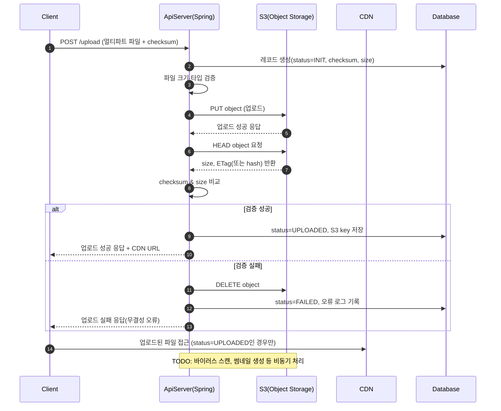

# 파일 업로드 서비스 명세서

## 개요

본 문서는 Ark 프로젝트의 파일 업로드 서비스에 대한 기술 명세서입니다.

## 목차

1. [서비스 개요](#서비스-개요)
2. [기능 요구사항](#기능-요구사항)
3. [비기능 요구사항](#비기능-요구사항)
4. [API 명세](#api-명세)
5. [데이터 모델](#데이터-모델)
6. [에러 처리](#에러-처리)
7. [보안 요구사항](#보안-요구사항)
8. [구현 계획](#구현-계획)

## 서비스 개요

파일 업로드/다운로드 서비스로 S3 스토리지와 연동하여 파일 무결성 검증 및 CDN을 통한 접근을 제공합니다.

## 기능 요구사항

- 멀티파트 파일 업로드 (checksum 포함)
- 파일 크기, 타입 검증
- S3 스토리지 연동
- 파일 무결성 검증 (checksum & size)
- CDN을 통한 파일 접근

## 비기능 요구사항

- 파일 크기 제한: 50MB
- 동시 업로드 사용자: 100명
- 파일 접근 권한 제어

## API 명세

### 파일 업로드
```http
POST /api/v1/files/upload
Content-Type: multipart/form-data

Request:
- file: (required) 업로드할 파일
- description: (optional) 파일 설명

Response:
{
  "success": true,
  "data": {
    "fileId": "uuid",
    "originalName": "example.pdf",
    "size": 1024000,
    "mimeType": "application/pdf",
    "uploadedAt": "2024-01-15T10:30:00Z",
    "url": "https://localhost:8080/api/v1/files/{fileId}/download"
  }
}
```

## 데이터 모델

### FileEntity
```kotlin
@Entity
@Table(name = "files")
data class FileEntity(
    @Id
    val id: String = UUID.randomUUID().toString(),
    
    @Column(nullable = false)
    val originalName: String,
    
    @Column(nullable = false)
    val s3Key: String,
    
    @Column(nullable = false)
    val size: Long,
    
    @Column(nullable = false)
    val mimeType: String,

    @Enumerated(EnumType.STRING)
    val status: UploadStatus, // INIT, UPLOADED, FAILED
) : BaseEntity()
```

## 에러 처리

### 에러 코드 정의

| 에러 코드                   | HTTP 상태 | 메시지                     | 설명              |
|-------------------------| ------- | ----------------------- | --------------- |
| FILE\_UNSUPPORTED\_TYPE | 400     | 지원하지 않는 파일 형식입니다        | 허용되지 않은 파일 확장자  |
| FILE\_SIZE\_EXCEEDED    | 400     | 파일 크기가 제한을 초과했습니다       | 최대 파일 크기 초과     |
| FILE\_MISSING           | 400     | 업로드할 파일이 없습니다           | 파일이 첨부되지 않음     |
| FILE\_NOT\_FOUND        | 404     | 파일을 찾을 수 없습니다           | 존재하지 않는 파일 ID   |
| FILE\_ACCESS\_DENIED    | 403     | 파일에 접근할 권한이 없습니다        | 권한 부족           |
| FILE\_UPLOAD\_ERROR      | 500     | 파일 업로드 중 오류가 발생했습니다     | 서버 내부 오류        |
| FILE\_TOO\_MANY\_UPLOADS | 400     | 동시 업로드 파일 수가 제한을 초과했습니다 | 다중 파일 업로드 제한 초과 |

### 에러 응답 형식
```json
{
  "success": false,
  "error": {
    "code": "FILE_001",
    "message": "지원하지 않는 파일 형식입니다",
    "details": "허용된 파일 형식: jpg, jpeg, png, gif, pdf, doc, docx, xls, xlsx, txt, zip"
  }
}
```

## 구현 계획

### Phase 1: 기본 기능
- [ ] 단일 파일 업로드/다운로드
- [ ] 파일 메타데이터 관리
- [ ] 기본 API 구현
- [ ] 파일 검증 로직

### Phase 2: 고도화
- [ ] 다중 파일 업로드
- [ ] 파일 검색 기능
- [ ] 업로드 진행률 표시
- [ ] 에러 처리 강화

### Phase 3: 확장 기능
- [ ] 클라우드 스토리지 연동
- [ ] 파일 미리보기 기능
- [ ] 바이러스 스캔 연동
- [ ] 성능 최적화


## 로직 플로우
